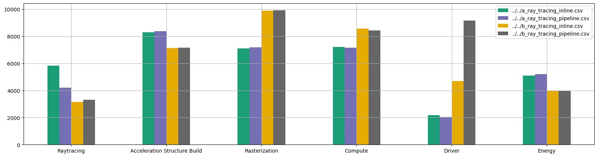
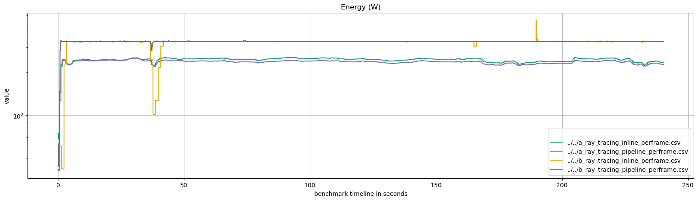
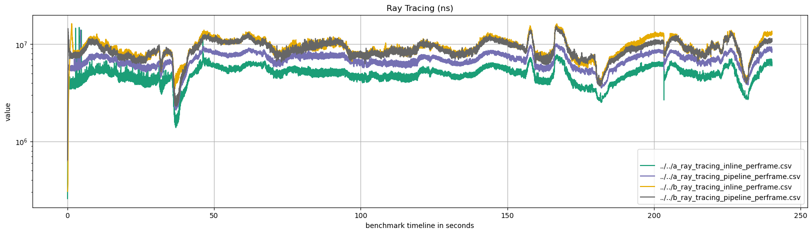
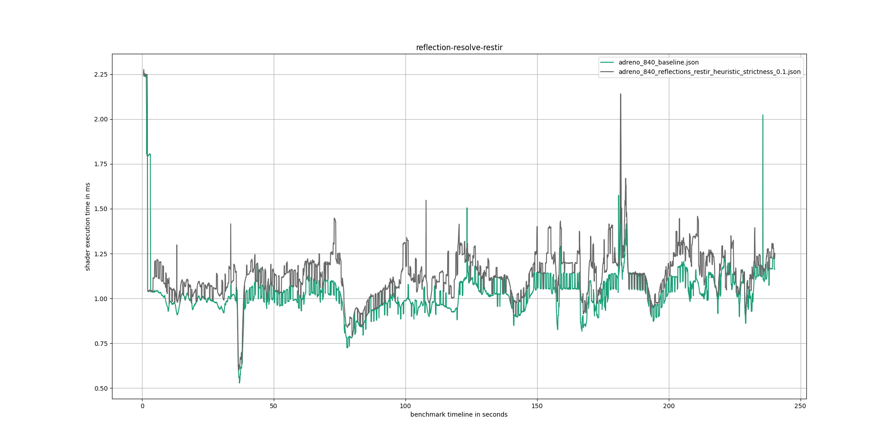
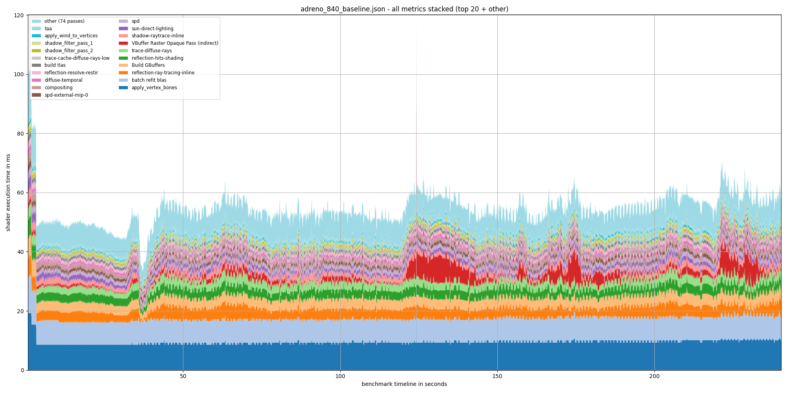

<div align="center">

# 📜 Evolve scripts

**Evolutionary benchmarking software**

[](https://traverseresearch.nl)

</div>

## 📊 Available tools

This repository contains multiple scripts which can be run as is for reporting purposes, or serve as a baseline/guide for custom analysis scripts. Below we list all tools, with example outputs below. We also mention which command line argument should be passed to Evolve to generate the requested graphs.

- **`run_on_android.py`** Launches the Evolve benchmark on a connected Android device over ADB and pulls the result files back to your machine. This script requires ADB (Android Debug Bridge) to be installed.
- **`compare_deep_analysis.py`** CLI tool that compares two deep-analysis exports and writes the top 20 passes with the largest mean / standard-deviation differences to CSV. Requires `--export-deep-analysis`.
- **`scores_plotter.ipynb`** Bar chart comparing the Evolve scores per metric across benchmark runs or devices. Requires `--export-scores`.

  

- **`per_frame_plotter.ipynb`** Line graph of the per score bucketed execution time/metric (frame time, ray tracing, rasterization, compute, driver, …) throughout the benchmark timeline. Can be used to compare between runs. Requires `--export-per-frame`.

  
  

- **`deep_analysis_plotter.ipynb`** Line graph of the execution time per render/compute/rt pass. Can be used to compare between runs. Requires `--export-deep-analysis`.

  

- **`frame_breakdown_stackplot.ipynb`** Stacked area chart breaking down each frame's GPU time by render/compute/rt pass (top 20 passes + other). Requires `--export-deep-analysis`.

  

## 📏 Capturing data

These scripts require specific custom Evolve outputs, which can be generated using the following command line arguments when launching evolve. 

 - `run-custom --export-scores scores.csv`
 - `run-custom --export-per-frame per_frame.csv`
 - `run-custom --export-deep-analysis deep_analysis.json`

## 👷‍♀️ Requirements

Please ensure the following dependencies are installed before running scripts from this repository:

- Python 3.11+
- ADB (Android Debug Bridge), only required for `run_on_android.py`

The scripts and notebooks depend on several Python packages, which can be installed with:

```sh
python -m pip install -r requirements.txt
```

## 📊 Comparing deep analysis output

Using the `compare_deep_analysis.py` script located in the `scripts` directory, you can compare the results of two separate deep analysis output files in multiple ways. For the analysis methods, the scripts will first do an attempt to average over all loop iterations of the output. If you ran Evolve with `--looping 5`, each frame in the output will use the mean from each frame from each of the Evolve benchmark iterations.

### Usage
```sh
usage: Evolve Deep Analysis Comparison [-h] [--pass_mean_comparison PASS_MEAN_COMPARISON] [--pass_stdev_comparison PASS_STDEV_COMPARISON] deep_analysis_file deep_analysis_file
```

### Parameters:

- `deep_analysis_file` - The path(s) to the input files to compare, produced by Evolve's deep analysis.
- `--pass_mean_comparison [filename]` - The csv file to which to output a comparison of the mean execution times of the render passes with the highest difference in mean execution times between the two. Example: `--pass_mean_comparison mean_difference.csv`.
- `--pass_stdev_comparison [filename]` - The csv file to which to output a comparison of the standard deviation over execution times of the render passes with the highest difference in standard deviation over the execution time, between the two. Example: `--pass_stdev_comparison stdev_difference.csv`.

At least one of `--pass_mean_comparison` or `--pass_stdev_comparison` arguments is required, as the script doesn't output any information by default.

### Example usage
```sh
python compare_deep_analysis.py --pass_mean_comparison mean_comparison.csv --pass_stdev_comparison stdev_comparison.csv deep_analysis_gpu_1.json deep_analysis_gpu_2.json
```
